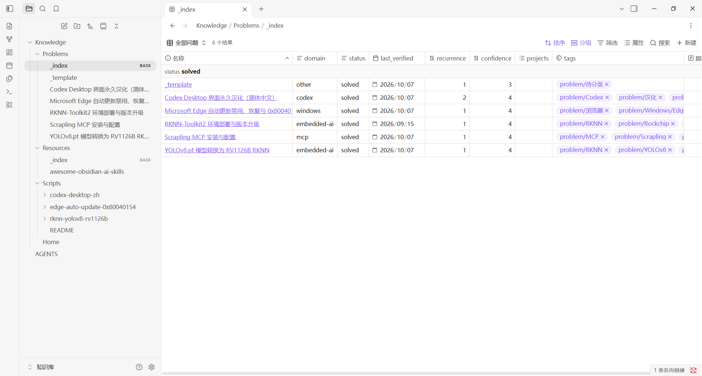

# obsidian-knowledge

一套让 Codex、Claude Code 等 AI 在 Obsidian 中记录、检索和维护知识点的知识库模板。包含 Obsidian 目录结构、Bases 索引、AI 操作规则和 Agent Skill。



## 快速开始

### 1. 获取仓库

```bash
git clone https://github.com/yiximy/obsidian-knowledge.git
cd obsidian-knowledge
```

### 2. 安装到 Obsidian Vault

```powershell
.\install.ps1 -VaultPath "D:\你的Vault"
```

脚本只复制缺失文件，不覆盖已有内容。安装完成后，Vault 中会生成：

```text
Knowledge/
├─ Home.md
├─ Problems/
├─ Resources/
└─ Scripts/
AGENTS.md
```

### 3. 安装并配置 Obsidian MCP

在 Obsidian 中安装并启用社区插件：

```text
Local REST API with MCP
```

然后：

1. 打开 `Settings → Local REST API with MCP`。
2. 启用 HTTP Server。
3. 复制 API Key。
4. 确认 MCP 地址为 `http://127.0.0.1:27123/mcp/`。

### 4. 配置 AI 客户端

Codex：

```powershell
[Environment]::SetEnvironmentVariable('OBSIDIAN_API_KEY','<API Key>','User')
codex mcp add obsidian --url http://127.0.0.1:27123/mcp/ --bearer-token-env-var OBSIDIAN_API_KEY
```

Claude Code：

```powershell
claude mcp add --scope user --transport http obsidian `
  http://127.0.0.1:27123/mcp/ `
  --header "Authorization: Bearer <API Key>"
```

其他支持 Streamable HTTP 的客户端：

```json
{
  "mcpServers": {
    "obsidian": {
      "url": "http://127.0.0.1:27123/mcp/",
      "headers": { "Authorization": "Bearer <API Key>" }
    }
  }
}
```

配置完成后重启 AI 客户端，确保 Obsidian 保持运行。

### 5. 安装 Agent Skill

```bash
npx skills add yiximy/obsidian-knowledge
```

也可以手动复制：

```text
skills/obsidian-knowledge-workflow
```

到：

```text
Codex:       C:\Users\<用户名>\.agents\skills\
Claude Code: C:\Users\<用户名>\.claude\skills\
```

### 6. 开始使用

打开：

```text
Knowledge/Home.md
```

然后可以直接对 AI 说：

```text
把这个知识点保存到知识库。

记录一下这个问题的根因和解决步骤。

查询知识库中关于 MCP 的资料。
```

## 包含

```text
Knowledge/
├─ Home.md
├─ Problems/       问题、根因、解决方案、案例记录
├─ Resources/      外部资料和网址
├─ Scripts/        与问题关联的脚本
├─ raw/            可选：LLM Wiki 原始资料
└─ wiki/           可选：LLM Wiki 编译后的知识页
AGENTS.md          AI 操作规则
install.ps1        把模板复制进现有 Vault
skills/
└─ obsidian-knowledge-workflow/
   ├─ SKILL.md       Agent Skill
   └─ assets/        初始化 Vault 所需的模板
```

## 保存一个知识点

1. 先搜索 `Knowledge/Problems`，确认是否已有相同问题。
2. 如果已有：更新 `last_verified`、`confidence`、`recurrence`，并把本次差异追加到「案例记录」。
3. 如果没有：复制 `Knowledge/Problems/_template.md`，填写：
   - `domain`：领域
   - `tags`：横向检索标签
   - 症状、调查过程、根因、解决步骤、验证
4. 如果生成脚本：保存到 `Knowledge/Scripts/<问题标识>/`，并在问题笔记的 `scripts` 中登记。
5. 如果只是资料或网址：保存到 `Knowledge/Resources/`，使用 `type: resource`。
6. 定期检查重复标签、孤立笔记和失效链接。

## 领域分类

当前建议领域：

```text
codex
obsidian
windows
mcp
embedded-ai
python
database
network
tooling
other
```

新增领域前先检查已有领域，不要创建近义领域。

## License

MIT
